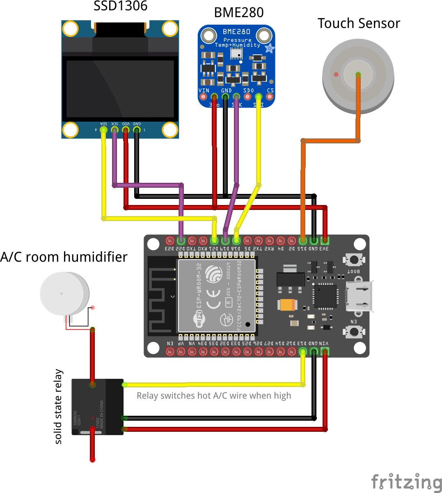
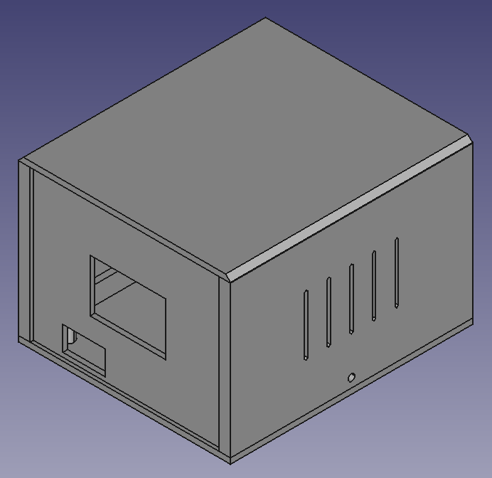
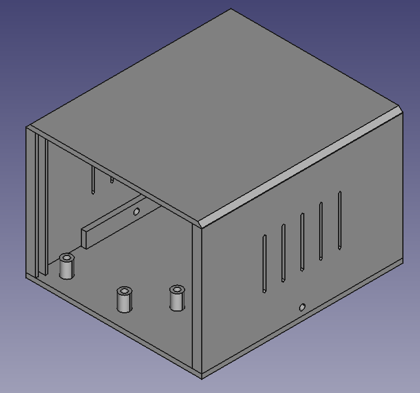
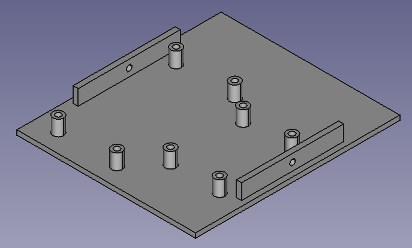

# micropython-humidistat

This project contains a humidistat class (humidistat.py) to control a GPIO connected to a relay, which switches a small humidifier on and off.  There are settings to control the cycle time such as the minimum running time, maximum running time, and minimum time to remain off.  The main script (main.py) has a web page interface to show basic run-state and allows the desired humidity to be set.  The capacitive touch sensor is used to briefly display the IP address and relay state on the OLED.  NTP is used to initialize the Real Time Clock (RTC), which affects the timing logic in the humidistat class.  This can be enhanced to allow more granular scheduling such as switching modes between on/off/auto.  The anytemp class is used to abstract reading from various I2C temperature/humidity sensors (BME280 or AHT10).  MQTT state messages are transmitted every 5 minutes or when events occur.

## Parts

- [ESP32 devkit - 30 pin, integrated antenna](https://www.aliexpress.com/item/1005001267643044.html)
- [0.96" OLED - white, I2C](https://www.aliexpress.com/item/32896971385.html)
- [AHT10 sensor](https://www.aliexpress.com/item/4000125110813.html)
- [BME280 sensor](https://www.aliexpress.com/item/4001098967210.html)
- [solid state relay - Omoron 5V 1-way high](https://www.aliexpress.com/item/32736680428.html)

## Diagram

2 separate I2C busses are used.  See [note about MicroPython and I2C](https://msgarbossa.github.io/documentation/MicroPython/libraries.html#note-about-micropython-and-i2c)

## Using the code

- copy boot.py.sample to boot.py and update variables
- echo "PASS = 'password'" > webrepl_cfg.py
- [upload all *.py files](https://msgarbossa.github.io/documentation/MicroPython/ampy.html) to ESP32 controller [flashed with MicroPython](https://msgarbossa.github.io/documentation/MicroPython/flash_firmware.html)

## 3D printed case

See [3d-printed-case](./3d-printed-case) for STL and FreeCAD files.  The FreeCAD file contains a spreadsheet to adjust most dimensions.

## Todo

- Basic scheduling such as the time to turn on (auto) and time to turn off
